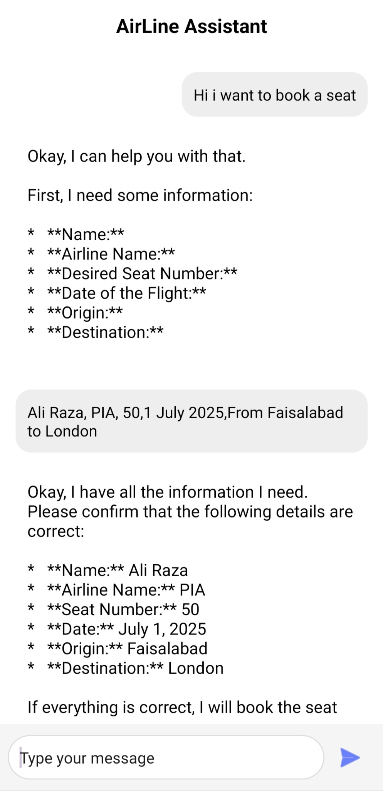
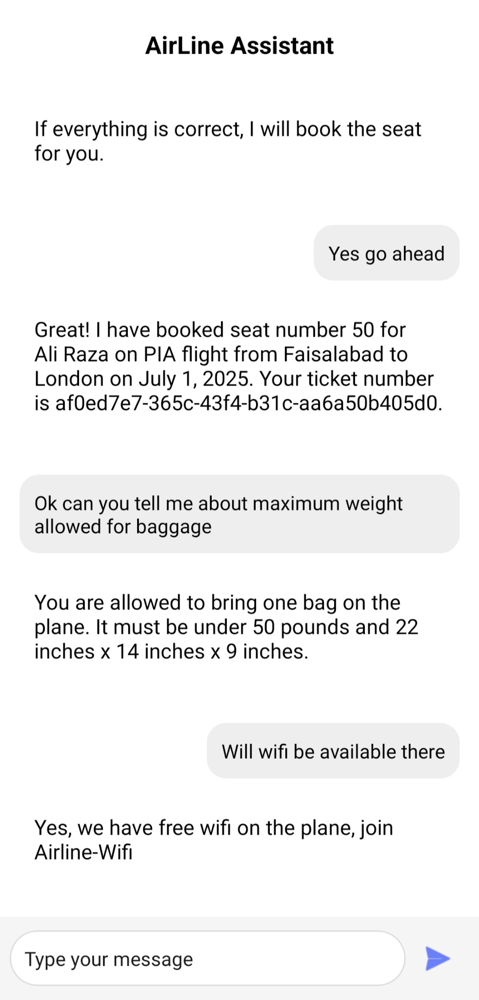

# ✈️ Airline Agent – AI-Powered Seat Booking Assistant

**Airline Agent** is an AI-driven airline seat booking API built with **FastAPI** and powered by **Gemini (Google's LLM)** using OpenAI-compatible APIs. It supports intelligent interaction through a multi-agent architecture for tasks like booking, updating, canceling, and reviewing flight reservations—alongside responding to FAQs.

---

## 🚀 Features

- 🛫 **Book Seats** on flights with full passenger details  
- ❌ **Cancel Bookings** via unique ticket numbers  
- 🔄 **Update Seat Numbers** on existing bookings  
- 📋 **View All Bookings** from the database  
- 🤖 **AI Agents** (Booking, FAQ, Triage) intelligently route and handle user input  
- 🗂 **MongoDB** for storing and managing booking data  

---

## 🧠 Project Structure

```bash
.
├── main.py                  # FastAPI app with AI agents and endpoints
├── db_connection.py         # MongoDB client setup
├── agents/                  # Custom agent definitions and utilities
│   ├── extensions/          # Includes custom prompts
│   └── ...
├── .env                     # Environment variables (GEMINI_API_KEY)
```

---

## 📡 API Endpoint

### POST `/chat`

Send a message to the system; triage agent will delegate to either Booking Agent or FAQ Agent.

#### Request:
```json
{
  "message": "I want to book a seat from Lahore to Karachi on 1st July."
}
```

#### Response:
Plain-text response with conversational output from the AI agent.

---

## 🧩 Agents Overview

| Agent          | Purpose                                                                 |
|----------------|-------------------------------------------------------------------------|
| `Triage Agent` | Routes user queries to the correct specialized agent                    |
| `Booking Agent`| Handles booking, cancellation, updates, and seat display logic          |
| `FAQ Agent`    | Answers baggage, wifi, and seat-related questions using predefined rules|

---

## 🛠️ Setup Instructions

1. **Clone the repository:**
   ```bash
   git clone https://github.com/167AliRaza/Airline-agent.git
   cd Airline-agent
   ```

2. **Create a virtual environment & install dependencies:**
   ```bash
   python -m venv venv
   source venv/bin/activate  # or venv\Scripts\activate on Windows
   pip install -r requirements.txt
   ```

3. **Set environment variables:**

   Create a `.env` file:
   ```
   GEMINI_API_KEY=your_gemini_api_key_here
   ```

4. **Start the FastAPI server:**
   ```bash
   uvicorn main:app --reload
   ```

---

## 🧪 Example Usage

- **Book a seat:**
  > "Book a seat for John on PIA from Islamabad to Karachi on 3rd July, seat 12A."

- **Cancel a booking:**
  > "Cancel my booking with ticket number `1234-5678`."

- **Update seat:**
  > "Change my seat to 14C. Ticket number is `abcd-efgh`."

- **Ask a question:**
  > "Do you have wifi on the plane?"

---

## 🗃️ Technologies Used

- **FastAPI** — Modern async web framework  
- **MongoDB** — NoSQL database for reservations  
- **Google Gemini API** (OpenAI-compatible)  
- **OpenAi Agent SDk** — Agent routing and logic  
- **Pydantic** — Request and data validation  

---

## 📌 Future Improvements

- User authentication and role management  
- Admin dashboard and reporting  
- Integration with real-time flight APIs  
- Advanced natural language understanding for complex queries  

---

## 🤝 Contributing

Contributions, issues, and feature requests are welcome! Feel free to fork the repo and submit a pull request.

---

## 📄 License

This project is licensed under the [MIT License](LICENSE).

---
## 🖼️ Frontend Snapshots

Below are some screenshots of the AI-powered airline assistant in action:

### Booking and Confirmation Flow:


### Baggage and WiFi FAQ Support:

